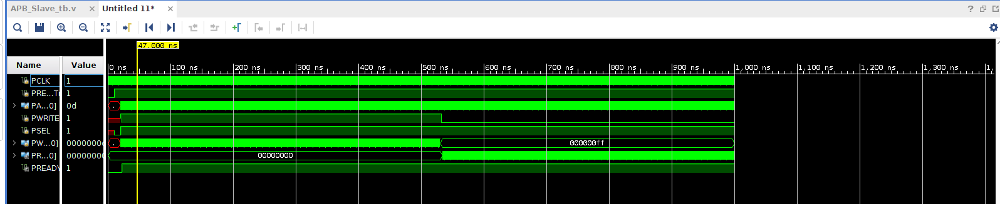

# A simple implementation to APB stub
## 1) APB Slave Block Diagram:

## 2) Test Bench Scheme:
	a) Write Ops for 256 times. 
	b) Read back 256 times from memory. 

	
## Test operations:
### read op: 

### write op: 

